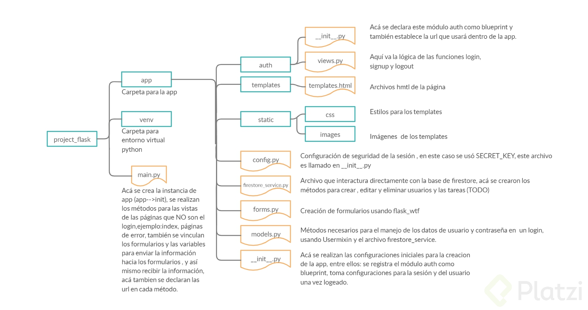

# ¿Qué es Flask?

Framework web de python

- Es un microframework -> Estructura fundamental lo mas simple posible y fácil de personalizar

- Mientras vaya creciendo la aplicacion se pueden aumentar las utilidades de flask

Similitudes con Django:

- El sistema de templates de flask (Jinja 2) esta basado en el sistema de templates de Django

Diferencias;

- Django es todo incluido

- Django usa arquitectura MVC, Flask no tiene una arquitectura especifica

- Django tiene un ORM, Flask no lo tiene

Para poder prender el servidor se debe tener esta variable de entorno:

        export FLASK_APP=[nombre del archivo]   

# Debugger

Mensajes de error aparecen en el browser -> Mas informacion sobre el error

Refresca automaticamente el codigo sin tener que apagar y prender el servidor

Variable de entorno para activar debugger:

        export FLASK_DEBUG=1

# Template Jinja2

Los templates son archivos html que permiten renderizar información estática y dinámica. Pasar variables al browser para ser renderizada

Flask esta configurado para buscar templates en un directorio que debe estar dentro de la carpeta de la aplicacion con el mismo nombre 'templates'

# Estructuras de control

        
            <h1>Hello World Platzi, tu IP es {{user_ip}}</h1>
        
            <a href="{{ url_for('index') }}">Ir a inicio</a>
        

Funcion 'url_for' se usa para extraer la ruta de la funcion que se quiere referenciar, es decir en este caso mirar a que URL corresponde la funcion index

        
            <li>{{text}}</li>
        

En el caso del for las variables dentro del for statement no deben tener doble llame porque se sobreentiende que es una variable de python

### Nota:

        **diccionario

Los dos asteriscos sirve para expandir un diccionario de tal manera que si se pasa como parametro se tengan las variables disponibles sin tener que llamar el nombre del diccionario

# Herencia de Templates

Heredar, extender o incluir templates en otros templates. Ayuda a ser reutilizable para ser mas eficientes en la manera de generar html

Para ello flask utiliza bloques de codigo 
        
         

Nota: Los corchetes no van solo el nombre de la variable

Y para extender un template se usa la logica de herencia de la POO:

        

Donde esta base.html va el nombre de el archivo padre 

### Macros

Son pedazos de código pequeños en otro archivo que son reutilizables.

- Se debe crear un archivo en la carpeta templates que se llame macros.html
Ejemplo:

        
            <li>Descripcion: {{text}}</li>
        

Para importar el archivo:

        

Para invocar el macros:

        {{macros.render_todo(text)}}

# Flask Bootstrap

Extensiones de flask, permite agregar paqueteria que amplie las funcionalidades de flask

Se debe cambiar el base.html debido a que bootstrap ya trae algunos elementos incorporados como el DOCTYPE, las etiquetas: html, header, body

Luego se usan los blocks del sistema de templates para renderizar los archivos html con los objetos de bootstrap

# Configuracion Flask

Por defecto flask usa un ambiente de produccion pero saca una advertencia de no usar el servidor de desarrollo para hacer el despliegue de la aplicación.
Esto debido a que hay mucha información que se puede ver del código que se ejecuta y esto puede ser una falla de seguridad.

                export FLASK_ENV=development

Modo desarrollo en flask

### Objeto Session

Flask tiene un objeto que permite encriptar las cookies asi evitando que se muestre información sensible a algun usuario no autorizado. Ejemplo de esto son las cookies que se crearon anteriormente.
Estas cookies pueden almacenar correos, credenciales etc...

- Se debe crear una llave secreta para poder usar session
- De esta manera se puede conservar informacion entre requests

Documentacion por si acaso:
https://blog.miguelgrinberg.com/post/the-flask-mega-tutorial-part-xi-facelift
https://getbootstrap.com/docs/5.1/components/navbar/

# Implementación de Flask-Bootstrap y Flask-WTF

Flask-WTF (What The Forms) -> Libreria de python para renderizar formularios web
Agregar a requierements.txt

Se debe crear una clase que maneje toda la parte del formulario:

                class LoginForm(FlaskForm):
                        username = StringField('Nombre de usuario: ')
                        password = PasswordField('Contraseña: ')

Los campos se deben importar de wtfforms.fields, para que se encargue de manipular los campos correctamente.

Ademas e debe validar que el usuario envia los datos requeridos, para ello se agrega un validadro de datos

# Uso del método POST en Flask-WTF

Por defecto las rutas en flask aceptan el método GET y para poder aceptar mas métodos es necesario especificar cuales.

                @app.route('/hello', methods = ['GET','POST'])
        
# App factory

Funcion que regresa la nueva app, dependiendo de lo que se necesite:

- Produccion
- Desarrollo

# Blueprints

Def: 
Son una serie de rutas que podemos integrar en nuestra aplicacion pero en otro directorio
es decir, me va a permitir modular la aplicación en pequeñas aplicaciones que hagan cosas específicas
como autenticación o la parte de welcome, o si tenemos un dashboard de tareas por ejemplo también
crearíamos un blueprint para las tareas específicas y es más fácil de manejar.
Es una pequeña aplciaciones de flask que tiene rutas, vistas, carpetas que debe ser importada desde una aplicacion de flask

Es decir que sirve para modularizar una aplicación de flask:

- Blueprint -> Auth
        - Vista de login

Debido a que los blueprints son aplicaciones que se encargan de pequeñas cosas es necesario que registrar el blueprint despues de crear la app

                app.register_blueprint(auth)
        
# Bases de datos

Flask no tiene ORM (Sistema de conversion de base de datos a POO)

Debido a esto flask puede usar cualquier base de datos solo hay que hacer la implementacion

Extension de SQL para manera bases de datos:
                SQLAlchemy

Ejemplo en con firestore de GCP

# GCP

1. Crear proyecto en GCP e iniciar una BD en firestore.
2. instalar el SDK de gcloud
3. hacer login desde la terminal: gcloud auth login
4. hacer login application-default: gcloud auth 
5. application-default login
6. inicializar: gcloud init
7. seguir las instrucciones y elegir el proyecto que creamos en GCP.
8. Ambiente de gcloud configurado y conectado a nuestra aplicación.

# Firestore

                export GOOGLE_CLOUD_PROJECT='ID del proyecto'

# Flask-login

1. Implementar login manager para inicializar la app
   1. En el archivo __init__ de la aplicacion
   2. Instanciar la clase y decirle la ruta donde se hara el login('auth.login' en nuestro caso)
2. Cargar al usuario